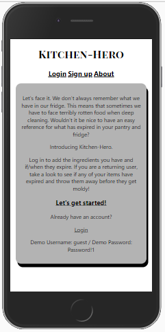
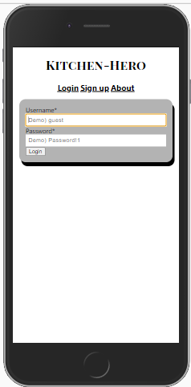

KITCHEN-HERO
## Link to the live project
VERCEL URL:    https://kitchen-hero.kayleighkat98.vercel.app/
HEROKU URL:    https://fierce-hollows-91839.herokuapp.com/ 
## Documentation for the API.
ROUTES:(for each path, add to the end of the api url)
    login {POST}
        '/api/auth'
    user {POST}
        '/api/user'
    all ingredients {GET, POST}
        '/api/ingredients'
    all expired {GET} 
        '/api/ingredients/expired'
    one ingredient {GET, DELETE}
        '/api/ingredients/:id'
## Screenshot(s)

## Summary
This is the client used by my app Kitchen-Hero. While logged in, add details about the items you have in your pantry and you can use the information later when cleaning your pantry by navigiting to the '/ingredient/expired' route.
## Technology
REGULAR DEPENDENCIES:
    classnames
    jwt-decode
    react
    react-dom
    react-router-dom
    react-scripts
    @testing-library/jest-dom
    @testing-library/react
    @testing-library/user-event
DEV DEPENDENCIES:
    cross-env
    enzyme
    enzyme-adapter-react-16

